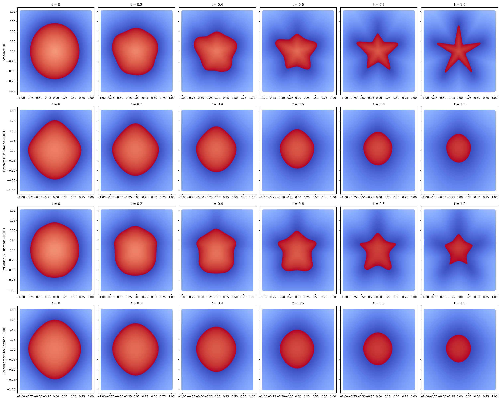
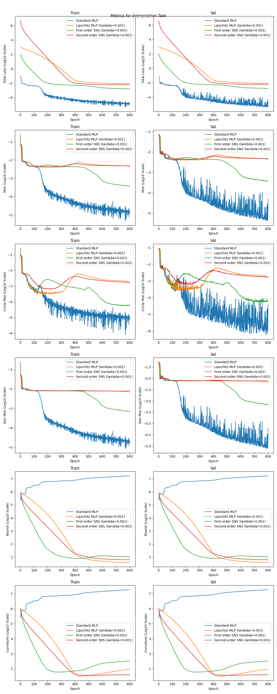

# Smooth Neural Surrogates for MPC

Partial reproduction of **[Learning Legged MPC with Smooth Neural Surrogates](https://arxiv.org/abs/2601.12169)** by Moore, Lee, and Chen.

This repository currently focuses on the **Smooth Neural Surrogate (SNS-MLP)** architecture and the SDF / shape-interpolation experiment. The MPC pipeline is partially implemented in code, but no MPC results are available yet.

## SDF interpolation

Current results from **Experiment 9 (`lr = 3e-4`)**:

The networks are trained only at the endpoint states, (t=0) and (t=1).

* The **standard MLP** fits both endpoint states almost perfectly, but develops strong *bubbling* artifacts when interpolating between them.
* The **first-order SNS-MLP** is still undertrained at the endpoints, but already produces considerably more coherent interpolation between the observed states.
* This qualitatively reproduces the main effect of the paper: controlling network smoothness improves behavior away from the training samples.

## Training metrics

The training dynamics also qualitatively follow the paper:

* The first-order SNS **star MSE is still decreasing**, suggesting that the endpoint fit has not yet converged.
* The standard MLP's Lipschitz bound grows rapidly, while the SNS-MLP bounds decrease during training.
* The curvature trends show the same separation, with SNS regularization progressively controlling the network derivatives.

## TODO

* Continue training the MLP/SNS models with a **smaller learning rate**.
* Finish the **MPC pipeline** and evaluate the learned models in control.

